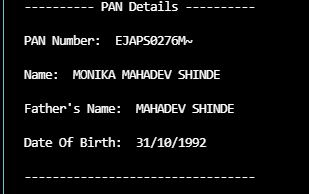

# PAN card OCR with pytesseract


Leverage the power of OpenCV and Pytesseract to effortlessly extract PAN card and adhar card details. This innovative solution utilizes advanced algorithms to interpret images, generating crucial information such as PAN number, Name, Father's Name, and Date of Birth. Experience streamlined processes and enhanced productivity with automated data extraction from PAN card images. 


## Requirements

pip install pillow

pip install ftfy

pip install io

pip install pytesseract

pip install numpy


  
## Run Locally

Clone the project

```bash
  git clone https://link-to-project
```

Go to the project directory

```bash
  cd PAN_card_OCR
```

Install dependencies

```bash
  install above packages
```

Run main file

```bash
  python main.py
```

  
## Screenshots
Query Image


Result Image




  
